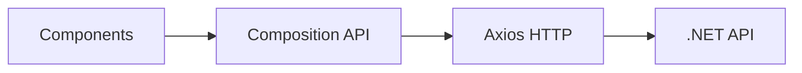

```markdown
# 📒 TakeNote - CRUD de Notas

**Um sistema simples e eficiente para gerenciamento de notas**

## 🚀 Sobre o Projeto

O **TakeNote** é uma aplicação web desenvolvida para estudos, implementando um CRUD completo
(Create, Read, Update, Delete) de notas. O projeto combina o poder do **.NET 8** no backend
com a flexibilidade do **Vue.js 3** no frontend.

### ✨ Funcionalidades

- ✅ **Criar** novas notas
- 📖 **Visualizar** lista de notas
- ✏️ **Editar** notas existentes
- 🗑️ **Excluir** notas
- 💾 **Persistência** em banco de dados PostgreSQL

## 🏗️ Arquitetura

### Backend (.NET 8)

    A[Controllers] --> B[Services]
    B --> C[Entity Framework]
    C --> D[PostgreSQL]
```

### Frontend (Vue.js 3)


## 🛠️ Tecnologias Utilizadas

### Backend
- **.NET 8** - Framework principal
- **Entity Framework Core** - ORM
- **PostgreSQL** - Banco de dados
- **Swagger** - Documentação da API
- **xUnit** - Testes unitários

### Frontend  
- **Vue.js 3** - Framework frontend
- **Composition API** - Gerenciamento de estado
- **Axios** - Cliente HTTP
- **CSS3** - Estilização

## 📦 Estrutura do Projeto

```
TakeNote/
├── 📁 Backend/          # API .NET
│   ├── Controllers/     # Endpoints da API
│   ├── Models/          # Entidades do banco
│   ├── Data/           # Contexto do banco
│   └── Services/       # Lógica de negócio
└── 📁 Frontend/         # Aplicação Vue.js
    ├── components/      # Componentes Vue
    ├── services/        # Comunicação com API
    └── assets/         # Recursos estáticos
```

## 🎯 Objetivos de Aprendizado

Este projeto foi desenvolvido com foco em:

- Arquitetura de APIs RESTful
- Entity Framework Core e migrations
- Vue.js 3 e Composition API
- Integração frontend/backend
- PostgreSQL e operações CRUD
- Boas práticas de desenvolvimento

<div align="center">

**Desenvolvido com 💜 para fins educacionais**

</div>
```
